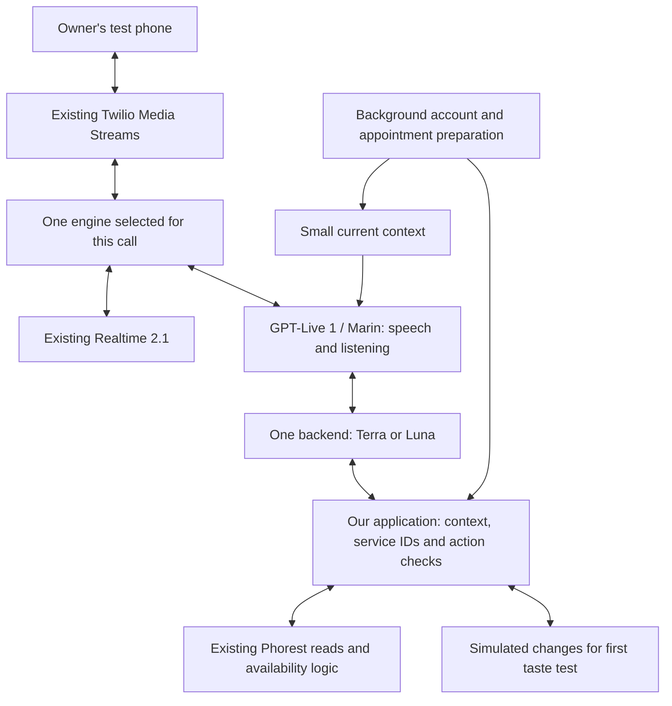

# GPT-Live implementation plan: get Erica onto a test call first

**Status: PROPOSED — ready for Fable review. No implementation or deployment authorized by this document alone.**

Owner: Codex implements after Aryan reviews Fable's feedback and approves the refined plan. Fable reviews the design and execution sequence. This document does not dispatch work or send anything to Fable.

**Operational update from Aryan, September 12:** customer intake to production Realtime 2.1 is disabled, so testing need not wait for an after-hours window. This is owner-reported state, not an independently verified forwarding/configuration change. Before a later deployment or test, check actual routing and active calls. Do not re-enable customer intake as part of testing.

## 1. What you will get first

**A real phone conversation with Live + Terra, using our actual salon information and availability, with booking changes simulated.** Then the same tests with Live + Luna and Realtime 2.1.

You will be able to judge voice, interruptions, waiting, caller recognition, service understanding and whether Erica asks useful questions. You will not have to wait for all production reliability work before hearing it.

The first complete taste test includes:

- Today's hours answered directly, without asking the backend or Phorest unnecessarily.
- Recognized-account and unknown-caller flows, with account/appointment data prepared during connection and greeting.
- Natural service requests: eyebrow threading, threading plus upper lip, tattoo versus touch-up, and ambiguous tint requests.
- Real availability and the existing nearby-date alternatives.
- A single appointment booking/change/cancel conversation through readback and approval, ending in a **simulated** result.
- A basic threading-and-tint visit-planning example against controlled appointments; real multi-appointment changes come later.
- Recordings, transcripts, chosen services/actions, latency and measured cost for comparison.

The tester is told before the call that changes are simulated; test outputs and the report are clearly marked. The first test cannot certify real booking success, SMS delivery, Richa's transfer connection, restart recovery or production readiness.

**Planning estimate:** first audible Live phone connection after roughly **4–6 focused engineering hours**; the useful comparison above after roughly **12–21 hours** total. Aim for 1–2 concentrated workdays, allowing another day if audio or delegation integration fails. These are effort estimates after review, not a promise or permission to skip failed checks. The earlier 31–48-hour design estimate covered substantially more production work.

## 2. Architecture we are implementing

**Keep one Node application, Twilio Media Streams, the existing Phorest adapter and Marin.** Use managed Responses delegation with Terra initially; Luna is a selectable comparison, not another agent in the same call. Realtime remains a separate selectable engine. No SIP migration, agent framework, vector database or full controller rewrite.

The choices have different jobs:

| Component | Responsibility | Practical reason |
| --- | --- | --- |
| Live | Listen, speak, clarify briefly, answer small current public facts. | Ordinary hours questions should not take a round trip through the reasoning model. |
| Terra/Luna | Interpret the request, select real services, plan the next useful step and request application actions. | Better reasoning should reduce the repeated clarification and fragmented visit planning found in production. |
| Application | Prepare context, validate service/account/action, check availability and execute or simulate. | The models do not become the authority for identity, calendar truth or successful writes. |
| Phorest | Actual catalog, client records and calendar. | Reuse the integration fixes already learned in production. |

## 3. Start from the right code

- Use recorded production behavior **`8533e61`** as the implementation baseline, subject to checking for a newer explicitly deployed revision before coding. Proposed isolated branch: `codex/gpt-live-taste-test`.
- Do not deploy current main wholesale. It contains unrelated/unreleased work. Preserve all existing dirty files and other worktrees.
- Bring this plan and the relevant design/issue documentation into the implementation branch. Review and selectively copy the existing `scripts/gpt-live/` probes; they are currently untracked and are diagnostics, not the application implementation.
- Reuse the production nearby-date, tattoo/brow/lash aliases, new-client email/consent fix, client prefetch and calendar rules. Keep `business.json` unchanged.
- Read focused cleanup `5769300` for its transfer-state and date lessons, but do not merge it as a prerequisite. Its narration tests still fail. Build the Live prompt explicitly rather than importing the held Realtime rewrite `37d1d93`.

## 4. Execution checklist and stopping points

Each checkbox is one reviewable implementation milestone with a commit, relevant tests and state update. Estimates overlap only where work is genuinely independent; no delegation is assumed.

### P0 — Establish the test boundary · 0.5–1 hour

- [ ] Create the isolated baseline, capture passing tests/build, and add server-controlled selection for `realtime`, `live-terra` and `live-luna`, fixed for the duration of each call.

Add an explicit test mode that allows real reads but simulates **all** Phorest writes: client creation, booking, reschedule, cancellation and notes. Suppress outbound owner SMS, schedule FYIs, post-call recap texts and real transfers. Ending the tester's own call and recording it remain enabled. Apply the boundary to either engine used in tests; do not rely on prompt instructions to avoid real effects.

Use a per-call in-memory simulation overlay so a simulated booking can later be listed, changed or cancelled consistently. Simulated IDs never reach the real adapter. Maintain a separate event kind for simulated outcomes so they do not count as revenue or production bookings. Availability remains a real snapshot, not a reservation; multi-step simulation must account for its own proposed schedule without claiming to reproduce every Phorest behavior.

**Done when:** both engine selections are pinned correctly, fake booking/message/transfer attempts cannot reach real side-effect clients, and ordinary Realtime behavior outside test mode remains unchanged. This boundary is required even though customer intake is disabled: our Phorest credentials still point at real records.

### P1 — Connect Live to the phone · 3–5 hours

- [ ] Add the small Live session/phone adapter and complete one real conversation with a harmless tool result.

Implement startup, greeting, input/output audio, managed Responses delegation, transcript collection, tool results, continuation, disconnect and usage collection. Reuse WebSocket dependencies and compatible 8 kHz audio; do not introduce audio transcoding without a demonstrated need.

Retain playback acknowledgements and bounded queues. Live emits continuous audio, including silence; it does not have Realtime's response-finished boundary. Distinguish generated speech, queued audio and played audio. Implement a bounded greeting retry/failure path, interrupted speech handling and a basic natural close. A dropped phone connection must close the model session and pending work.

**Done when:** a controlled phone call hears the greeting, can speak/interrupt, gets a verified tool answer, can finish normally, and leaves no running session. Validate startup **and the first backend delegation** with the actual API; an accepted session alone does not validate backend configuration.

**First checkpoint:** invite Aryan to the short connection/voice check. Do not hold this checkpoint for catalog polish or the full hardening backlog. It is not yet the full taste test.

### P2 — Prepare caller context and answer simple questions directly · 2–4 hours

- [ ] Reuse caller prefetch and implement the short Live/backend context split.

At connection, start caller-ID lookup and catalog preparation alongside model setup. On an account match, warm upcoming appointments. Distinguish `matched`, `not_found`, `loading` and `failed`; appointment state similarly distinguishes a successfully empty result from unfinished/error. Preserve the existing bounded greeting wait; late results update context without restarting the greeting or overwriting a different identified person.

Prepare a compact backend snapshot: candidate account, identity status, appointment list/search period, timestamps and task revision. Put full account data behind application identity checks. A candidate match is not an identified caller. Preserve the existing brief identity question before account disclosure; no new last-four challenge or unsolicited named greeting.

Live receives today's verified hours, salon-local date, tomorrow/next-open information, address, current closure/transfer facts and only the next relevant caller-context step. Update time-sensitive facts at relevant boundaries. Once identity is confirmed, deliver the relevant prepared appointment result to the backend without a redundant model-driven database fetch. If it arrives after work starts, queue the update with explicit ordering/revision; a cached tool response is the fallback if proactive context delivery is not yet proven reliable.

Unknown number means **no number match**, not “new client” or “salesperson.” Determine purpose from the conversation; support existing clients using another phone. Do not preload complete history/notes/preferences for every caller.

**Done when:** known caller with today's appointment, known caller with none, different person on a known number, unknown caller, slow lookup and failed lookup all behave correctly. “Today's hours?” should answer with **zero delegation and zero Phorest requests during the answer path** in the controlled test.

### P3 — Understand real services and plan the visit · 3–5 hours

- [ ] Add catalog-grounded backend tools, real availability reuse and minimal single-/multi-service planning.

Give the backend the current compact catalog with IDs, names, prices, durations and approved aliases; keep it out of the small Live prompt. Select by catalog ID and use the same selection for prices and availability. Validate every ID against the current catalog. Add a small canonical-ID entry point into the existing availability pipeline rather than sending a correctly resolved service back through permissive fuzzy matching.

Preserve date, timezone, staff, grid/runway, duration and nearby-search rules. Negative cases such as henna brows must not become threading. Preserve full-treatment vs touch-up distinctions. A person plus time with no treatment is missing a service; tint may need one meaningful clarification.

Start visit planning with existing bundles. For separate threading/tint, accept selected services and a date/window, check a bounded number of feasible sequences using actual durations and staff, and return one plan. Do not build a general optimizer. Show both appointments before proposing to move either; refresh dependent state after simulated changes. If a feasible plan cannot be established, say so.

Every correction advances a task revision. Late availability from the old service/date must not become a current offer. Independent reads can run in parallel within bounded limits; results for changing records must remain ordered.

**Done when:** the September 10 threading-and-upper-lip phrase selects the real bundle without triggering the Manu guard; tattoo/touch-up/unsupported-service cases stay distinct; paired threading/tint can be planned together; date restrictions and changed requests survive lookup races.

### P4 — Complete simulated actions and capture evidence · 2–4 hours

- [ ] Implement the test action workflow, compare-ready logs/recordings and a small failure suite.

Preserve one-question phone-first/name-second collection. Model a selected action as an immutable proposal: person, service/appointment, date/time, revision and proposed change. Require an explicit readback/approval step before simulated execution; identity confirmation is not booking approval. Invalidate the proposal on corrections. Simulated actions execute once and subsequent reads reflect them.

This exercises the future action interface without claiming that spoken approval is production-certified. The full evidence/authorization gate for real writes belongs in P6. Simulated owner messages and no-answer transfers return labelled test outcomes; they do not prove actual delivery or transfer routing.

Log call/engine/model/prompt versions, context-ready times, delegation count, cache hits, requested service IDs, proposals, simulated actions, errors, useful speech timing and costs. Use existing protected recordings/transcripts where possible; do not rebuild the dashboard. Limit retained private data and never log secrets or full phone numbers.

**Done when:** a full simulated book → change → cancel sequence works; repeated events do not repeat simulated effects; a correction invalidates the old proposal; no real write/SMS/dial is possible; recording and action evidence can be compared.

### P5 — Run the owner comparison · 1–2 hours

- [ ] Run the three variants and produce a short result sheet with recordings and the next concrete fixes.

Use the existing local/ngrok call harness for the earliest phone conversation, after adapting it to the test boundary. **The current script is not safe to run unchanged:** it uses real writes/transfers, prints full phone numbers, and outbound callback caller ID is the salon number rather than the tester's number.

For local recognition cases, add an authenticated, server-owned test scenario bound to the created call ID: recognized account, no upcoming appointment, unknown caller, delayed match. Never accept an unauthenticated caller-supplied client-ID override. Mark these as simulated identity scenarios. They verify the flow, not real incoming caller-ID routing.

After the implementation/review gate, deploy a clean tested snapshot to the existing Railway service while customer intake remains disabled, with the owner test boundary enabled. An inbound owner call there proves genuine caller-ID recognition and hosted audio behavior. This hosted test is required before marking the whole recognition path validated; no new service/number is required by default. If the local tunnel is unavailable, use this hosted test path first rather than spending a day building another environment.

**Done when:** Aryan has heard all three versions, we have usable recordings/action traces, and the scorecard identifies a preferred candidate or a specific blocker. No automatic customer cutover follows the test.

## 5. Test script and comparison rules

Use the same service catalog snapshot, scenario fixtures, model effort and backend prompt for Terra/Luna. Start at `low` effort for both; record the actual accepted configuration. Realtime keeps its released prompt/model as the product baseline. Test mode is the shared side-effect boundary, not a Realtime prompt rewrite.

| Test | Required behavior / what to compare |
| --- | --- |
| Today's hours, tomorrow's hours, reopening | Direct accurate answer; no unnecessary delegation, lookup or expired closure wording. |
| Recognized caller with today's appointment | Warm data; identity once; no repeated phone/account lookup. |
| Recognized caller with no appointments | State the checked period accurately; do not invent an appointment or treat them as new. |
| Unknown number, existing client / sales pitch / new booking | Classify purpose from speech; take the appropriate path. |
| “Is Richa available at six?” | Clarify speak-vs-book when needed; never invent a treatment. |
| “Eyebrow threading and upper lip” | Correct bundle first time, no person-name misclassification. |
| “Brow threading, lip and tint” | Preserve all services; clarify only actual ambiguity. |
| Tattoo / full microblading / touch-up / henna brows | Correct service identity or honest uncertainty/unavailable result. |
| Move threading and tint together | Plan the visit before changing it; no unnecessary third operation. |
| Friday afternoon / “only Saturday” / correction mid-lookup | Preserve preference and restriction; discard stale offers. |
| Phone consent declined; 12:15 corrected to 12:45 | Correct contact and proposal; no action from the identity yes. |
| Interrupt, pause, “Hello?”, long message, goodbye | Natural handling; no repeated greeting, clipped close or lingering session. |

Start with about **six owner calls** covering multiple scenarios—two per version—plus matched automated replays of the key cases. Repeat every failure and promising improvement with a paraphrase. This is enough to guide the next iteration, not to claim statistical superiority or publish p95 latency from a handful of samples.

Measure first **useful answer heard**, not “let me check”; tool-result-to-useful-answer delay; total task time; unnecessary questions; correctness of service/person/time; erroneous simulated actions; and owner listening preference. Capture actual Live voice usage, backend usage and telephone/recording cost separately; incomplete usage must be labelled. Compare warm and cold lookups rather than averaging them together.

Provisional tuning targets, not vendor guarantees: simple fact answers should be close to Realtime's measured baseline; routine delegated answers should aim for no more than roughly one additional second at the median. If missed, first inspect unnecessary delegations, repeated context/tool requests and audio queue delay. Do not hide waiting behind extra chatter or remove correctness checks to hit a number.

## 6. What remains after the first taste test

### P6 — Real controlled actions and full phone behavior

- [ ] Select/refine the model and prompts from P5 evidence.
- [ ] Complete real action authorization: bind the identified person and current immutable proposal to full readback and subsequent assent evidence; distinguish identity yes/backchannel/booking yes. Test late transcripts, overlap and corrections. Do not trust a model-provided `confirmed:true` or a yes regex alone.
- [ ] Add ordered writes, semantic deduplication, durable uncertain-operation handling and bounded read-back reconciliation before enabling real appointment writes. Preserve client-create single-flight and placeholder-email opt-outs. Require fresh availability success; do not retain the fail-open write path.
- [ ] Test real appointment/client/note changes on labelled controlled records; independently verify results in Phorest and clean up only those test records. Confirm realistic provider behavior for multi-service changes and report partial success honestly.
- [ ] Adapt complete message capture to Live transcript fragments; preserve exact caller message vs generated recap distinction and actual Twilio delivery-status handling.
- [ ] Test real Richa transfer answered/no-answer/busy, return-to-Erica state, no redial, recording continuity, graceful close, dead-call cleanup and model-independent failure behavior. Use controlled destinations before the actual owner transfer test.

The earlier detailed design remains the technical reference for these guarantees. Speech interruption does not undo a submitted booking; finish/reconcile it before acting on a changed request. Single-process journal/locking is the initial deployment assumption; no distributed “exactly once” claim.

If reliable spoken approval cannot be established, keep real writes blocked and bring the concrete failing recordings back for review. Application-led confirmation or keypad approval would be a separately reviewed product change, not an invisible workaround.

### P7 — Decide whether to restore customer intake

- [ ] Pass focused regression/failure checks, verify the exact deployed source/configuration, and run controlled real inbound calls.
- [ ] Review recordings and actual outcomes; retain the Realtime code/configuration as the alternate engine and the pre-Live deployment as rollback.
- [ ] Present the measured quality/latency/cost result and remaining limitations to Aryan. Customer routing resumes only on his separate go-ahead.

Engine selection is pinned per call. Swapping the default affects new calls; it does not magically move a partially completed conversation between engines. A mid-call failure uses a tested, bounded recovery/close path and preserves any uncertain operation.

## 7. Proposed code boundaries for the implementer

Paths below are proposed additions unless marked existing. Group small helpers where practical; they are responsibilities, not a requirement to create a large framework.

| Area | Files / concrete work |
| --- | --- |
| Engine selection and phone lifecycle | Existing `src/realtime/twilioStream.ts` WebSocket entry; add `src/voice/engine.ts` and `src/voice/liveCall.ts`. Keep Realtime implementation intact as far as practical. |
| Live protocol | `src/voice/liveSession.ts`: session/audio events, delegation batch, one continuation, timeout/close/usage. `scripts/gpt-live/` supplies verified probe patterns, not production controllers. |
| Conversation and task prompts | `src/voice/livePrompts.ts`: separate short Live and backend builders; reuse facts from existing `src/core/hours.ts` and business configuration. |
| Prepared caller/task state | `src/voice/callContext.ts`: bounded prefetch, explicit pending/error states, identity binding and context revision; reuse Phorest reads. |
| Tools and service planning | `src/voice/liveTools.ts`; small production-preserving seam in `src/services/booking.ts` for canonical service IDs and existing slot/nearby logic. Do not duplicate calendar mathematics in a new tool layer. |
| Test side-effect boundary | `src/voice/testEffects.ts` plus minimal dependency wiring around existing `PhorestPort`, owner SMS/recaps and transfer clients. Existing `src/services/phorest.ts` selection remains real reads by default; do not globally set `USE_MOCK_PHOREST=true`. |
| Test entry and deployment config | Existing `scripts/test-call-local.sh`, `src/routes/twilio.ts`, `src/config/env.ts`; authenticated scenario selection, engine persistence through test return paths, redacted output. Proposed setting names must be finalized in P0. |
| Evidence | Extend existing `src/services/callStore.ts`/admin only as needed for engine/test/action/timing metadata. Private audio/logs stay outside Git; publish a redacted comparison report. |

Before changing extraction boundaries, identify the actual entry point in the selected baseline; filenames here are an implementation map, not evidence that these additions already exist.

Protocol acceptance checks must cover the existing findings: `session.start` on the Live endpoint; supported Marin/audio shape; no copied Realtime input/VAD fields; nested Responses tool events; all outputs returned before one continuation; duplicate/late events; backend update ordering; continuous output including silence; and normal close with final usage. Revalidate greeting and both model configurations against the first real delegation. See [OpenAI migration](https://developers.openai.com/api/docs/guides/live-migration) and [delegation](https://developers.openai.com/api/docs/guides/live-delegation) guidance.

Keep stable public facts in short Live context; long procedures and catalog data belong to the backend. Explicitly distinguish direct-answer and delegate conditions. Updates carry current facts, not another layer of conflicting rules. See [OpenAI prompting guidance](https://developers.openai.com/api/docs/guides/live-prompting).

## 8. Review and delivery procedure

**Fable should review this plan against the production source and issue register, then return:**

1. Blocking correctness issues with the specific milestone and smallest proposed correction.
2. Work we can remove or defer without weakening the owner test.
3. Whether the test boundary covers every write, notification and transfer path in both engines.
4. Whether managed Responses plus prepared context can avoid redundant lookup turns without losing identity/revision control.
5. Whether canonical-ID selection and minimal visit planning reuse enough existing calendar logic.
6. Any missing audio/delegation/recognition check that could invalidate the taste test or its comparison.
7. A revised effort estimate only where backed by a concrete dependency or omission.

Return **approve**, **approve with specific changes**, or **revise before implementation**. Do not implement or deploy as part of that review. Avoid expanding the first test into the full production backlog; link deferred concerns to P6/P7.

After Aryan approves the refined plan, Codex executes P0–P5, commits after each checkbox, runs relevant tests plus the required regression suite/build, and updates state with exact completion and pending work. Verify the test boundary before placing calls; run a fixed process without source-watch restarts during listening. For a hosted test, package only the exact tested Git snapshot, verify source/health/configuration and preserve disabled customer intake. No raw transcripts, recordings, credentials or local output directories enter the release archive.

Evidence sources and precedence:

- **This plan** governs first-test scope, ordering and Aryan's latest disabled-intake update.
- [Production issue register](PRODUCTION_ISSUES_AND_GPT_LIVE_2026-09-12.md) supplies the real failure cases and distinguishes incidents from source risks.
- [Detailed system design](GPT_LIVE_SYSTEM_DESIGN_2026-09-12.md) supplies the protocol and later production-hardening details. Its full-hardening sequence is not a gate before the first simulated-write owner call.
- [Latest recorded production release](reviews/NEARBY_TATTOO_RELEASE_2026-09-10.md) identifies reusable behavior and the source baseline.
- `scripts/gpt-live/README.md` and [September 10 evaluation](GPT_LIVE_1_EVALUATION_2026-09-10.md) contain earlier probe instructions/results; that evaluation and the scripts are currently local/untracked. The earlier hours-only latency sample does not establish full-call performance.

**Delivery for this request:** this review document only. No code, model configuration, phone routing, deployment, call or Phorest write has been changed by preparing it.
