# Erica: production issues and what GPT-Live would change

Prepared September 12, 2026. Main review window: **August 29–September 12, Eastern time**. Earlier incidents that explain fixes made in this window are explicitly identified below.

## The decision in plain English

**Live plus a reasoning model is worth testing for Erica. The strongest opportunity is understanding the whole request and completing it with fewer unnecessary questions. It does not automatically fix booking reliability.**

Two recent calls make the case better than a hypothetical example:

- **September 10, 3:32 PM:** a customer asked for “eyebrow threading and upper lip.” Our application incorrectly classified that phrase as a staff-name request, matching **Manu**. Erica then asked which service they wanted again. The customer had already said it clearly enough for Erica to quote the bundle's price. This is a language-matching defect in our code as well as a poor conversation.
- **September 10, 3:17 PM:** a customer wanted a threading bundle and eyebrow tint moved to another day, close together. Erica moved the threading first, discovered the tint also needed moving, then moved threading again to make the visit fit. The call lasted **4 minutes 6 seconds**, with **three successful reschedule operations on two appointments**. A reasoning model with the complete visit in view is a promising way to plan this better.

The counterexample is equally important: **September 7's lost new-client booking was caused by Phorest rejecting a missing email.** Better understanding alone would still have hit the same rejection. We must retain the integration fix.

My recommendation is to build one small Live test path, start with Terra, and compare Luna against exactly the same scenarios. Keep Realtime 2.1 available. Let the owner hear the difference early, before completing every production-hardening item.

## What was reviewed, and what “verified” means

- Git history across branches, release notes, `state.md`, `tasks/lessons.md`, the September 1 and 3 prompt audits, the September 2 reliability backlog, and September 8–10 incident/release reviews.
- A fresh production call-metadata fetch returned **51 calls over the rolling 15-day endpoint window**. Of those, **49 fall within August 29–September 12: 18 known owner tests and 31 external calls**. External includes vendors, inquiries and calls with no caller transcript; it does not mean 31 confirmed salon clients.
- Full September 10 transcripts for all **11 calls**, their tool outcomes, and **1,127 historical Railway log rows** from that day. Earlier cases use the recorded independent investigations linked below, which include full transcripts and historical tool/API evidence. This is not a claim that every recording or every historic log was re-reviewed today.
- The latest available QA email, **“Erica QA — clean — Sep 12 AM,”** and September 10 PM's report. The latest report's zero-call window was independently confirmed against production metadata. A quiet window does not certify the system.
- Source checks use the recorded deployed behavior **`8533e61`**, not local `main`. Release ancestry was checked. The broader prompt rewrite `37d1d93` and focused cleanup `5769300` are **not** in that production lineage.

**VERIFIED** means the stated behavior is supported by source, transcript, metadata or tool/API evidence, as identified. **LIKELY** means the explanation or wider exposure remains an inference. **NEEDS LISTEN** means the recording is necessary to resolve an audio claim. **FALSE POSITIVE** means the evidence does not support the alleged defect. Source/probe findings are explicitly marked; they are not automatically customer incidents.

No recordings were listened to in this register-building pass. Transcript text cannot establish clipping, exact words heard, interruption timing or who physically hung up. No appointment, client, message, call or deployment was created or changed. Private evidence stays untracked under `outputs/production-issues-2026-09-12/` and the earlier review folders.

This is a consolidated register of documented issue families, not a count of unique incidents or proof that every historical incident was retained.

## How the proposed architecture addresses these problems

```mermaid
flowchart LR
    C[Caller] <-->|Telephone audio| T[Twilio: carries the call]
    T <-->|Speech and listening| L[Live: conducts the conversation]
    L <-->|Request and relevant context| R[Terra or Luna: plans the task]
    R <-->|Lookups and proposed actions| A[Our application: checks and executes]
    A <-->|Real services, clients and appointments| P[Phorest: salon records]
```

| Component | What it means for the caller | Why it exists |
| --- | --- | --- |
| Live | Erica listens, speaks and handles conversational interruptions. | Conversation should not require the same model to carry every detailed booking procedure. |
| Terra or Luna | Works out whether Richa is a person, which treatments the caller means, and how several appointments fit into one visit. | Gives task planning its own model and instructions, grounded in our actual catalog and tool results. |
| Our application | Checks the person, service, chosen time and approval, then submits the change once. | A plausible model answer is not proof that an action is permitted or that a slot exists. |
| Phorest | Supplies the real services, durations, prices and calendar; stores the result. | Salon records remain authoritative. |

OpenAI documents Live's separation of conversation from delegated reasoning and tools. The case-specific improvements below are **our engineering expectations to test**, not published Erica accuracy guarantees. See [OpenAI delegation guidance](https://developers.openai.com/api/docs/guides/live-delegation). Live also changes audio/event handling, so this is more than changing a model name; see [OpenAI migration guidance](https://developers.openai.com/api/docs/guides/live-migration).

The reasoning model receives contextual text through the delegation path; it is not independently listening to the raw phone audio. If a name or time is misheard, reasoning can help use context, but cannot guarantee recovery of what was actually said.

## A. Understanding services and the customer's whole request

| ID / problem | Evidence and existing fix | What Live + reasoning could change; what we retain |
| --- | --- | --- |
| **01 — Richa treated as a service, or a service invented for her availability** | **VERIFIED historical owner tests**, August 27, carried into the September 1 audit. “Richa availability” went through service lookup; another test supplied only a person/time but the model invented Brow Threading. Person-name matching and tool instructions were added. [S1, S2] | Strong opportunity: identify **person**, **intent**, and **service** separately; ask for the treatment only when it is missing. Retain validation that the selected service exists and was grounded in the caller's request. Do not assume a familiar stylist implies a treatment. |
| **02 — “Is Richa available?” triggers an unwanted transfer** | **VERIFIED owner-test behavior**, August 29 and earlier. `ade8b16` added a clarification rule and transcript-based transfer guard; deployed August 29. [S1] | Reasoning should better distinguish speaking to Richa from booking with her. The two meanings remain genuinely ambiguous. Keep a short clarification when needed and application-controlled transfer eligibility. |
| **03 — Eyebrow threading rejected although Brow Threading exists** | **VERIFIED customer incident**, September 7, 1:03 PM: three service clarification questions; historical tool log returned not offered. Narrow aliases shipped September 8, followed by focused brow/lash synonyms in `fcee0d8`. [S3, S4] | Strong semantic benefit: select the existing Brow Threading service without asking the caller to learn its database name. Retain the tested alias during migration; remove redundant phrase handling only after equivalent tests pass. |
| **04 — Brow/lash/eyebrow/eyelash word variants** | **VERIFIED catalog/probe issue family**, covered by September 8 focused synonym release. Not a separately proven customer failure for every phrase. [S4] | Let the backend map normal language to catalog identities. Keep salon-specific distinctions and exact IDs. “Tint” alone may still mean brow or lash; ask once if context does not settle it. |
| **05 — A threading-and-lip phrase is mistaken for a person** | **VERIFIED customer incident**, September 10, 3:32 PM, last four 9523. First tool argument: `eyebrow threading and upper lip`; log classifies it as staff **Manu**. Second request using `Brow Thread + Lip Thread` succeeds. Still open in the deployed baseline. [S8] | This is a priority taste test. Backend selects the real bundle, and our application accepts its catalog ID. Also narrow the fuzzy staff guard: a correct backend should not depend on working around this bug. This is stronger evidence than simply saying Realtime “isn't smart enough.” |
| **06 — Eyebrow tattoo needs another service clarification** | **VERIFIED customer conversation**, September 9, 2:52 PM: tattoo → shading → correct full Micro Blading/Shading booking. `6c51261`, deployed with `8533e61`, maps eyebrow/brow tattoo to the full service. No wrong-service booking established. [S5, S7] | Reasoning can use the approved salon mapping directly. Keep this mapping as business knowledge; do not assume “tattoo” universally means microblading at every salon. |
| **07 — Full treatment confused with a touch-up or another service variant** | **VERIFIED read-only matcher probes**, September 8–9: generic microblading selected a six-month touch-up; microshading/brow shading variants missed; underarm wax selected the beginner/girls line. These probes do not establish customer misbookings. Tattoo alias fixes only its narrow case. [S3, S5] | Give the backend explicit distinctions: full treatment vs touch-up, adult vs junior. Ask the meaningful eligibility question when needed. Require an exact intended service in tests; “some match was found” is insufficient. |
| **08 — One visit handled as unrelated appointments** | **VERIFIED customer sequence**, September 10, 3:17 PM, last four 3216. Threading moved, tint moved, threading moved again. All three operations returned success. Caller had to ask to put them closer together; final transcript says the arrangement was perfect. [S8] | Strongest Terra/Luna planning comparison. Show the whole visit, clarify which services should move, find a feasible sequence, then present the plan together. Keep real duration/staff checks and ordered writes. A model cannot make a partially completed multi-write change atomic. |
| **09 — Multiple services understood but not guaranteed to fit** | **VERIFIED source/probe risk**, September 2 multi-service concurrency audit. The user's threading + lip + tint request is also an important acceptance case, not a separately verified historical incident. [S6] | Reasoning can break down the request and prefer a real catalog bundle. Application must validate combined duration, order, staff and availability. Reuse catalog packages first; a small visit-planning function is justified, a general scheduling optimizer is not required for the first trial. |
| **10 — Full requested day becomes a conversational dead end** | Owner feedback from September 9; **VERIFIED feature gap and released fix**. `8533e61` checks bounded nearby dates and returns actual alternatives. September 10, 3:32 PM transcript/logs show fallback working. [S5, S7, S8] | Keep the existing bounded nearby search. The backend can choose and explain better alternatives without repeated questions, but must use returned times and honor “only today.” No need to replace working search with a sequence of model-directed network calls. |
| **11 — Broad “afternoon” preference becomes an unnecessary exact-time question** | **VERIFIED September 2 probe finding**, FR-20. No separate customer harm count. [S6] | Backend should preserve the time window. Make the availability interface accept it directly; do not force the model to invent a specific time. This is a small tool-contract improvement, not a new subsystem. |

## B. Conversation, caller details and closure behavior

| ID / problem | Evidence and existing fix | What Live + reasoning could change; what we retain |
| --- | --- | --- |
| **12 — Repeated identity/name questions or bundled questions** | **VERIFIED owner-test complaints**, August 28; later source conflict said both reuse details and ask everyone for names. Rework improved the flow; `bc39b09` aligned missing-name collection. Owner rejected combining phone/name into one question. [S1, S4] | Backend tracks what is known and asks only the next missing question. Preserve phone-first/name-second and explicit identification; fewer questions does not mean skipping the owner's chosen flow. |
| **13 — Caller asked to retry a number already checked at pickup** | **VERIFIED historical owner tests** in September 1 audit, C5. Caller-ID miss was not explained clearly enough to the model. Resolution of this specific case is not established by the release notes. [S1] | Pass compact facts: calling number already checked, matched/no match/still loading. Backend asks for the appointment's number or name as appropriate. Reuse caller prefetch; a timeout must not be treated as no account. |
| **14 — More-help question after an explicit goodbye** | **VERIFIED external transcripts**, September 3 vendor and job-inquiry calls. September 8 `bc39b09` reconciled unconditional closing instructions. No widespread client farewell loop proven. [S4] | Live/backend instructions should agree on when the request is finished. Expect more natural closure, but retain tested goodbye delivery and allow a real new request to reopen the conversation. |
| **15 — Tool narration, jargon and robotic dates spoken aloud** | **VERIFIED transcripts** across September 3 and 10: “live call,” repeated checking/submitting language, dates read as `2026-09-11`; older internal “Call ended”/“wrap up” examples. Focused cleanup `5769300` is **not deployed**, and narration probes still fail. [S1, S2, S4, S8] | Keep procedure detail in the backend; give Live concise customer-facing facts and the next useful question. This is a promising reason for the split, not proof it will always stay silent during work. Ear-test ordinary lookups and longer delays. |
| **16 — Repeated return date after unclear speech / “Hello?”** | **VERIFIED repeated text**, September 3 and 9; **NEEDS LISTEN** for cause. September 4 repetition answered the caller's explicit question and was a **FALSE POSITIVE**. [S4, S5] | Live's conversation handling may help recovery. Do not ban repetition of information the caller missed. Test pauses, interruptions and “Hello?” on the phone; text timing does not prove a VAD fault. |
| **17 — Noise or an empty turn produces a menu or another greeting** | **VERIFIED transcript/probe behavior**, September 2–3; whether each event was noise rather than untranscribed speech needs audio. `wait_for_user` exists in local `37d1d93`, **not production**. [S2] | Live's continuous conversation model may reduce forced-response workarounds. Implement and test its own silence/greeting behavior; do not port Realtime's VAD/no-op workaround unchanged. Preserve dead-call cleanup and a reasonable silence policy. |
| **18 — Names/times appear as unrelated words or other languages in transcripts** | **VERIFIED text artifact**, September 1/3 audits and fresh September 10 calls. Examples include time responses transcribed as “January 15” and “Á.” Exact spoken content remains **NEEDS LISTEN**. English/vocabulary settings were probed, not established as deployed by those audits. [S1, S2, S8] | Live replaces the old input/transcription path; expect to re-evaluate recognition, not copy old settings. Backend context can help but may also guess incorrectly. Keep explicit readback of consequential times and tested message completeness. |
| **19 — Transfer status says Richa can be reached while salon closure says otherwise** | **VERIFIED rendered-source conflict**, September 1. Combined status and closure policy shipped through September 1–2 releases. [S1, S6] | Keep a single application-computed answer about closure/transfer eligibility. A stronger model should not have to reconcile contradictory facts. |
| **20 — Ambiguous reopening date, internal “vacation” wording, stale closure notice** | **VERIFIED source/probe defects** addressed September 1–2 and September 9 reopening release `0b70df6`. Old closure instructions otherwise risked influencing normal hours after reopening. [S1, S6, S7] | Reuse business.json and date-based policy. Give models only currently relevant public facts. Models do not replace a date clock or the owner's wording/privacy policy. |
| **21 — Asking for Richa leads straight to a message although Erica could help** | **VERIFIED reviewed conversation/flow weakness**, addressed September 3 need-discovery release `117ada0`: understand the need during closure before message-taking. [S2] | Backend classifies the actual need—booking change, hours, personal callback—then uses the right path. Preserve an explicit request to speak to Richa when a live transfer is permitted. |
| **22 — Invented explanation for an unavailable slot** | **VERIFIED historical internal transcript** quoted in September 1 audit: an unsupported story about the online calendar updating slowly. Broader cleanup is local; do not mark completely fixed. [S1, S2] | Tell the backend to report known facts and Live to explain the result simply. Return distinct unavailable/closed/error states. More reasoning does not make an invented explanation true. |

## C. Booking, transfers and messages

| ID / problem | Evidence and existing fix | What Live + reasoning could change; what we retain |
| --- | --- | --- |
| **23 — New client cannot book because Phorest requires an email** | **VERIFIED customer failure**, September 7: two `EMAIL_REQUIRED` errors, no booking. September 2 omission caused the regression. September 8 `acbed9c`/release `1425f8c` restored placeholder email with both email consents opted out; exact tenant payload tested. [S3] | **No model-level fix.** Retain the shared payload builder and opt-outs. Real tenant behavior outranks generic API assumptions. Better recovery wording is useful but would not save this booking without the integration repair. |
| **24 — Booking happens without final service/date/time approval** | **VERIFIED internal sequences** September 2 and **VERIFIED customer safeguard skip** September 9: time choice/contact answers followed by write without final readback plus a new approval. `bc39b09` strengthened instructions, but the September 9 call shows the remaining gap. No unwanted booking proven. [S2, S5] | Reasoning may follow the process more reliably. Application must require approval of the current proposal and invalidate it when the service/time/person changes. This is justified by an actual failure after a prompt fix. |
| **25 — Requested time and booked time differ / unclear time accepted** | September 2 owner test transcript says 12:45 but record says 12:15; September 10 tint moved to 3 PM after unclear transcript replies. **VERIFIED discrepancy/sequence; NEEDS LISTEN** before calling either an unauthorized or misheard booking. [S2, S8] | Backend can interpret context, but guessing is not approval. Read the selected time back clearly, obtain agreement, and write exactly that proposal. An allowed slot is not necessarily the slot the caller chose. |
| **26 — Cancel just-booked appointment fails because appointment ID is used as client ID** | **VERIFIED historical owner test**, August 27, fixed September 1 in `4bf33ac`: preserve newly booked selection, clarify parameter types and guard the mix-up. [S1] | Reasoning should confuse IDs less often, but keep typed references and selection state. Ideally the backend asks to cancel the selected appointment instead of copying unrelated IDs between tools. Reuse the existing guard. |
| **27 — Internal schedule FYI described as the caller's message** | **VERIFIED historical internal conversation**: after cancellation, Erica said Richa had a text and would follow up. `a616ca3`, deployed September 1, moved FYI notification into application code. [S1, S6] | Retain automatic notifications as code. A backend should not decide whether operational FYIs happen or narrate them as a customer-requested message. |
| **28 — Message sent before real caller content is captured / message confused with summary** | **VERIFIED source/probe risk and corrected flow**, September 2: separate message tool, explicit collection state, exact caller text, late-transcript handling. September 3 recaps are a separate generated artifact. [S6] | Preserve this distinction. Adapt capture to Live's transcript fragments; the old Realtime item-ID boundary cannot simply be reused. Neither model should invent the caller's message from “wants Richa.” |
| **29 — Message claimed successful when Twilio rejected it or was still uncertain** | **VERIFIED source/probe risk**, fixed September 2 with bounded wait, required message ID and status mapping. This is not a count of proven lost customer texts. [S6] | Retain the delivery-status code. Accepted for delivery is different from delivered; a timeout is different from known failure. Model wording should reflect the application result. |
| **30 — Failed transfer returns to a fresh greeting and another promise to connect** | **VERIFIED customer transcripts and logs**, September 10, including 12:27 and 4:50 PM. Actual dial reports no-answer; Erica restarts, attempts the transfer tool again, and code suppresses a second dial. `5769300` addresses state/prompt consistency locally, **not deployed**. [S8] | Preserve call state across the transfer: already tried, not answered, next choices. Reasoning can recover naturally, but the return path and no-redial enforcement are application responsibilities. Two transfer tool calls here do not mean two actual dial attempts. |
| **31 — Sales pitch forwarded to Richa instead of declined** | **VERIFIED external transcript/tool behavior**, September 10, 12:22 PM: printing pitch taken as message; same caller at 3:14 PM correctly declined. Sender affiliation is self-reported. [S8] | Backend can screen the purpose before transfer/message and change course when a pitch becomes clear. Use the same policy after transfer failback. Keep a deliberate allowance for legitimate business/personal messages; do not block every non-client. |
| **32 — Goodbye generated after hangup, clipped, mechanical or missing** | **VERIFIED historical internal timing/code issue**, August 27, followed by September 1 `47d92d4`/`6f696a4` tool-only close and separate farewell response. Remaining delivery races are source risks below; not every generic hangup label is a clipped goodbye. [S1, S6] | Live may sound better, but our program still controls the telephone disconnect. Rebuild goodbye settlement for Live's continuous audio and retain Twilio playback acknowledgements. Do not wait for Realtime's `response.done`, which Live does not provide. |

## D. Reliability findings: real engineering work, not all customer incidents

These were found in the September 2 functional audit and rechecked against the migration design's production-source assessment. Several fixes shipped, several remain partial. “Open” below describes a missing guarantee, not proof that a customer was harmed.

| ID / failure condition | Status and why it matters | What the Live implementation needs |
| --- | --- | --- |
| **R01 — Booking a known closed date after an availability error** | Closure rejection fixed September 2. Fresh availability errors on otherwise open dates still have a fail-open path in the September 12 source assessment; the older backlog's broad fail-closed wording overstates coverage. | Reuse closure checks; require a successful fresh check before a real write. Live does not fix this. |
| **R02 — Concurrent new-client creation produces duplicates** | Single-flight identity resolution and an uncertain-create latch shipped September 2 (`9afb433`, `a71477a`). Protection is in-process. | Retain normalized-phone plus confirmed-person binding. A model upgrade does not replace concurrency control. |
| **R03 — Two appointment changes execute together** | FR-02 open: multi-service requests can produce parallel writes. | One small queue for appointment changes; independent reads can remain parallel. This protects an ordinary multi-service call. |
| **R04 — Repeated event or equivalent tool request writes twice** | FR-04 open beyond specific guards such as already-cancelled IDs. | Remember operation identity and reuse its result. One repeated instruction must not become two bookings. |
| **R05 — Timeout after a write, followed by a duplicate retry** | Client creation partially protected; appointment-write reconciliation remains open. Existing HTTP layer already avoids blind write retries. | Mark outcome uncertain, read back to reconcile, block another submission until resolved. Restart-safe storage is required before claiming restart-safe protection, not before a simulated-write taste test. |
| **R06 — Goodbye while a queued action is unresolved** | FR-06: in-flight guard exists, but it does not fully settle all tools from one model response. | Wait for the action batch and report uncertainty before closing. Live requires its own delegation/continuation controller. |
| **R07 — Appointment belongs to a different person after identity switches** | FR-11 plus September 12 source audit: served-ID tracking exists; complete appointment-subject binding is missing. | Bind actions to the deliberately identified person. Switching family member invalidates incompatible selections. No extra last-four identity interrogation is proposed. |
| **R08 — Calling number attached despite missing/declined consent** | Existing phone-first policy is primarily model-enforced; omitted phone can fall back to caller ID. | Record the number choice in application state. This preserves the owner's existing policy rather than adding another customer question. |
| **R09 — Reschedule a cancelled appointment** | Fixed September 2 (`fc66f9d`) using lifecycle state. | Keep the code check and reuse it from both voice engines. |
| **R10 — Fatal voice-model fallback dials during a closure** | FR-07 is a deterministic fallback/policy boundary, not solved by the normal transfer prompt. | Agree the model-independent fallback behavior and apply closure/transfer policy there too. Do not rely on a model after its session has failed. |
| **R11 — Duplicate/colliding Realtime response requests** | FR-12/15: request/acknowledgement and recoverable-error races. | Do not port obsolete Realtime event machinery into Live. Build one correctly ordered Live continuation path, returning every tool result once. Similar ordering problems remain possible in the new protocol. |
| **R12 — Late playback marks or an empty queue cause premature completion** | FR-13/14: reused marks and brief queue gaps are source risks. | Unique playback marks and clear-generation tracking; explicit bounded close behavior. Live does not supply proof that the caller heard a line. |
| **R13 — Appointment at closing time / duration beyond close** | FR-16 boundary finding; not established as a customer incident or a completed fix in this window. | Keep deterministic hours and service-duration validation. Test the exact closing boundary. |
| **R14 — Owner change notification omits the original time** | FR-17 source finding: ambiguous when a client has multiple appointments. | Build old/new details from application state. No model needed for the operational facts. |
| **R15 — Broad retry instructions disagree with tool-specific rules** | Source conflict fixed by `bc39b09`: at most one safe retry, preserve uncertain-write exceptions. | Reuse classified outcomes and recovery rules in backend/tool results. Do not repeat competing retry policies across prompts. |

Source: [September 2 reliability backlog](FUNCTIONAL_RELIABILITY_BACKLOG_2026-09-02.md) and [September 12 production-source design assessment](GPT_LIVE_SYSTEM_DESIGN_2026-09-12.md). The latter governs where its current-source findings differ from older release summaries.

## E. Reporting, release and older infrastructure lessons

| ID / issue | Evidence / status | Effect of Live |
| --- | --- | --- |
| **O01 — Successful reschedules flagged because `bookings[]` is empty** | **FALSE POSITIVE as evidence of write failure.** September 10 PM QA assumed every write enters this field. Production source records new bookings there; reschedules record successful tool rows and outcome. Four successful reschedule operations across three distinct appointments are logged. No fresh independent Phorest calendar reconciliation was performed in this pass. | Keep event types explicit in reporting. Better models cannot correct a misleading metric definition by themselves. An optional separate mutation audit is useful, but this field alone is not evidence of a lost appointment. |
| **O02 — “Caller hung up” recorded for application-initiated endings/transfers** | **VERIFIED source ordering / reporting problem**, including September 9 investigation. Twilio stop can win while REST is awaited, before reason/outcome is stamped. Physical hangup initiator remains unknown from the label alone. | Preserve requested action and confirmed carrier result separately; fix event ordering. Do not use this label to grade Live's politeness. |
| **O03 — Normal socket teardown logged as an error** | **VERIFIED September 9 correlation** to Twilio stop. September 10 has the same warning family and expected transfer teardown. A 1005 alone is not a service outage; a dropped result during redirect is not automatically a failed booking. | Classify expected teardown separately from unexpected mid-call failure in both engines. Retain correlation and recordings. |
| **O04 — QA overstates evidence or misclassifies callers** | September 3 QA routine was hardened; September 8/9 independent reviews corrected hangup, repetition and client-identity assumptions. September 10 PM contains the reschedule-field error above and describes second tool attempts as dial attempts. | Reuse independent evidence checks. Better QA prompting helps, but metadata definitions and recording access remain necessary. |
| **O05 — Owner cannot see useful outcomes / business callers called clients** | September 3 `117ada0` added/refined external-call recaps and caller categories. Exact caller messages and generated recaps are separate. | Reuse recap and notification infrastructure; update Live transcript/usage ingestion. Do not rebuild working owner reporting. |
| **O06 — Broad matcher fix silently changes the requested treatment** | **VERIFIED unreleased regression**, September 8 assessment: deleting unknown words made “henna brows” resolve to Brow Threading. Narrow production release excluded it. | Canonical-ID proposals plus meaningful service tests are better than permissive word deletion. A reasoning model can also make an overconfident semantic substitution; test negative examples. |
| **O07 — Green tests or merged main mistaken for production readiness** | **VERIFIED release-process problem**: mock catalog richer than real catalog; live expectations wrong; diagnostic payload differed from app; main includes unreleased prompt/matcher work. Narrow release used exact real payload and source hashes. | Test real catalog identities, actual handler contracts and phone behavior. Keep Realtime rollback and build the Live path from verified production lineage. A model migration does not solve release discipline. |
| **O08 — Dead telephone streams keep AI sessions alive** | **Earlier, August 27 internal tests**: missing stop events left sessions running; media-inactivity watchdog and forensics added. Twilio 31924 protocol errors were observed; Railway proxy corruption was a hypothesis, not established root cause. | Reuse transport liveness/cleanup. Live does not repair the carrier or WebSocket path; continuous sessions make bounded cleanup and cost tracking important. |
| **O09 — Silence watchdog interrupts a long caller message** | **Earlier customer incident, August 24**, documented in state/lessons: timer measured from speech start although no intermediate VAD events arrived. Existing fix accounts for active speech. | Preserve the lesson, adapt the implementation: ongoing speech is not silence. Test a long dictated message with pauses before production. |
| **O10 — Phorest dates, filters, phone formats and grid quirks** | **Earlier integration defects**, retained in lessons: appointment reads local, availability UTC, writes local; snake_case client/date filters; 10-digit numbers; odd-minute availability and duration fit. Not new September incidents. | Retain the real adapter and its tests. These are precisely the proven plumbing we should reuse; no reasoning model can make a wrong API payload correct. |
| **O11 — Session-field mistakes, rate limits, live restart and stale dashboard hazards** | **Earlier operational lessons**: unsupported OpenAI fields reject the whole session; Tier-1 token starvation; saving watched source restarts calls; cached admin responses obscured live data. Historical mitigations exist. | Validate Live's actual session schema, use its usage units, preserve monitoring/no-cache behavior and isolate owner testing. These are environment/protocol responsibilities. |

### September 10 QA reconciliation

The latest September 12 AM report contains no incident leads. Its **September 11, 5:37 PM–September 12, 8:37 AM ET** zero-call coverage is **VERIFIED**. Fresh warning-ring entries are outside that window. This says nothing about whether forwarding or demand explains the quiet period.

For September 10 PM's incident-bearing report:

- **VERIFIED:** 11 call records in its window, two reschedule calls, no new booking rows, and successful reschedule tool records. Logs show **four writes affecting three distinct appointments**, because one threading appointment was moved twice.
- **FALSE POSITIVE:** empty `bookings[]` implying a silent reschedule failure; see O01. Tool success is still not a substitute for an independent calendar audit when one is required.
- **NEEDS LISTEN:** last four 3216's unclear time answers, and last four 7609's 1:59 PM transfer ending. We cannot confirm exact spoken approval or connection delivery from text alone.
- **VERIFIED:** printing pitch was forwarded at 12:22 PM and declined at 3:14 PM; message tool success supports forwarding acceptance, not a claim that Richa read it.
- **VERIFIED:** transfer callbacks include no-answer followed by Erica failback. Where a second transfer tool call appears, the log says it was suppressed; the report's “two unanswered dial attempts” wording is inaccurate for the 12:27 PM call.
- **FALSE POSITIVE as automatic defect labels:** no-outcome after a declined/no-selected alternative, and expected transfer-failed tool results. Greeting-only calls and precise audio causes remain **NEEDS LISTEN**, not certified clean or broken from transcript absence.
- Teardown warnings are **LIKELY expected** for the September 10 group based on transfer/stop context; the independently correlated September 9 examples are **VERIFIED**. No blanket claim that all historical 1005 errors are harmless.

The service/staff false match and whole-visit planning problem were identified by reading the full evidence, rather than inheriting the QA report's “clean” heading.

## What to reuse, simplify and build

| Decision | Specific scope | Engineering reason |
| --- | --- | --- |
| **Reuse** | Phorest adapter, live catalog/cache, caller prefetch, business hours, nearby search, phone/email normalization, SMS status handling, recording/admin surfaces, transfer routing and no-redial guard. | Already solves real integration problems. Replacing it would add risk without improving caller understanding. |
| **Simplify after comparison** | Repeated clarification scripts, duplicate prompt rules, mechanical preambles, some phrase-specific matching. | These are candidates for better backend interpretation, not code to delete on faith. Keep approved catalog aliases as data. |
| **Build for the first owner call** | Live transport adapter, one delegation controller, short conversation prompt, backend prompt, catalog-grounded service selection, enough session state for corrections, simulated write results and recording. | This is enough to hear language, pacing, service understanding and basic task flow while exercising real reads. |
| **Build before real customer writes** | Exact proposal/approval gate, person binding, ordered/deduplicated mutations, uncertain-outcome handling, tested transfer/message/goodbye settlement. | Directly justified by this register. These are action-integrity requirements, not optional model polish. |
| **Defer unless evidence demands it** | Multiple specialist agents, automatic Luna→Terra routing, vector database for the 63-service catalog, a new telephony stack, a general scheduling optimizer, complete observability rebuild. | Start with one backend and existing infrastructure. Each extra component needs a measurable benefit. |

The first Live implementation should give both price and availability tools the same canonical service selection. Otherwise the caller can hear the right price, then hit a different match on the next tool—as September 10 illustrates. Prefer a catalog ID internally, with a caller-friendly label externally; validate the ID against the current catalog.

For a multi-service visit, begin with existing catalog bundles and a small sequential plan. Present all affected appointments before moving them. If one change succeeds and another fails, report partial success accurately and offer recovery; do not promise all-or-nothing behavior that Phorest does not provide.

## The owner taste test and model comparison

Use three selectable versions: **current Realtime 2.1**, **Live + Terra**, **Live + Luna**. The two Live versions get the same catalog, backend instructions, tools and test data. Keep the current Realtime version as the product baseline, including its existing fixes.

| Test call | What “better” means |
| --- | --- |
| “Is Richa available at six?” / “Can I speak to Richa?” | Correct distinction; no invented service or unwanted dial. |
| “Eyebrow threading and upper lip” | Correct bundle on the first lookup; no staff-name diversion or repeat service question. |
| “Threading, lip and tint” | Preserve all requested services; clarify only a genuinely ambiguous tint or package choice. |
| “Eyebrow tattoo” / “microblading touch-up” / “henna brows” | Correct full-vs-touch-up distinction; unsupported treatment does not become threading. |
| “Move my threading and tint to Friday, close together” | Look at the whole visit, offer a feasible arrangement, avoid unnecessary extra changes. |
| “Friday afternoon; if not, only Saturday” | Preserve the time window and date restriction; return actual options. |
| New caller, then a correction from 12:15 to 12:45 | Phone/name flow preserved; current proposal read back; only the approved time submitted. |
| Caller says “no” to using the calling number | Collect the replacement number; no silent fallback to the rejected number. |
| Richa does not answer; caller leaves a long message | No fresh greeting/redial promise; complete caller message; truthful acknowledgement. |
| Background speech, “Hello?”, pause, interrupt goodbye | Natural recovery, no premature action or clipping; judged from recording. |
| Write times out / same action arrives twice | No duplicate write; honest uncertainty. Exercise with controlled failures. |
| Reopening day and a fully booked day | Correct current hours, no expired closure story; useful verified alternatives. |

For each version record **correct service/visit**, **unnecessary questions**, **wrong or duplicate actions**, **successful completion**, **wait after the caller stops**, **wait after tool results**, **total call time**, **actual voice/backend/telephone cost**, and **owner listening preference**. Score hard action errors separately: a warm, cheap wrong booking is not a win.

Start with Terra as the quality-oriented candidate, with Luna as the efficiency comparison. This register gives good reasons to test stronger planning, but does not establish that Terra will win. Avoid choosing based on generic model descriptions or one successful scripted call. Repeat the difficult cases and include paraphrases/corrections.

**Sequence:** first complete the small test path and make the owner call with real reads and simulated writes; then address observed quality failures; then exercise controlled real writes and fault cases; finally consider a customer rollout with Realtime rollback available. This refines the earlier design's sequencing: the full hardening estimate is not a prerequisite for the first taste test. No percentage reduction in incidents or final per-call saving is yet measured.

## Evidence index

- **S1:** [September 1 prompt audit](PROMPT_AUDIT_2026-09-01.md), especially C1–C13 and B1–B14. Historical owner-test evidence must not be presented as customer damage.
- **S2:** [September 3 prompt audit](PROMPT_AUDIT_2026-09-03.md). Its claims about interruption causes and “fixed” behavior are narrowed by later independent review; local changes are not deployed changes.
- **S3:** [September 8 release assessment](reviews/RELEASE_ASSESSMENT_2026-09-08.md), including September 7 transcript/API evidence, real-catalog comparison and the email regression; release status in `state.md` September 8 hotfix entry.
- **S4:** [September 8 repetition review](reviews/REPETITION_PROMPT_REVIEW_2026-09-08.md), [synonym release](reviews/SYNONYMS_RELEASE_2026-09-08.md), [conversation release](reviews/CONVERSATION_RELEASE_2026-09-08.md).
- **S5:** [September 9 independent call review](reviews/CALL_REVIEW_2026-09-09.md), with private transcript/tool/Phorest evidence references.
- **S6:** [September 2 functional reliability backlog](FUNCTIONAL_RELIABILITY_BACKLOG_2026-09-02.md), FR-01–FR-20; confirmed current boundaries in [September 12 design](GPT_LIVE_SYSTEM_DESIGN_2026-09-12.md).
- **S7:** [September 10 nearby/tattoo release](reviews/NEARBY_TATTOO_RELEASE_2026-09-10.md) and [reopening release](reviews/REOPENING_RELEASE_2026-09-10.md).
- **S8:** Fresh September 10 full transcripts, production metadata and historical logs in local `outputs/production-issues-2026-09-12/`. Customer call references: combo `CA85c9db416495728578a30a9b5e0ec42c`; paired reschedule `CA0d5e586f24051ef7e1d8f5ee0c45a79a`; single reschedule `CA56ca38365ad234e2d9c96f4790136173`; vendor `CA69a94bf535bc338279163004fd234064`; failback examples `CAb6f414487742d8fbe905b29a6457dac7` and `CA4692de2d1423d376a85443f9ae049dbd`. These are evidence locators, not public recording links.
- Older infrastructure/integration evidence: dated entries in [state](../state.md) and [lessons](../tasks/lessons.md). Focused cleanup candidate: `5769300` in `codex/focused-cleanup-2026-09-10`; held, with narration failures still documented.

Key release commits whose ancestry into recorded production `8533e61` was checked: `ade8b16`, `6f696a4`, `4bf33ac`, `a616ca3`, `2d24cfe`, `eca23f1`, `117ada0`, `1425f8c`, `fcee0d8`, `bc39b09`, `0b70df6`, `6c51261`. Commit messages alone were not used as proof of customer impact or completeness.
