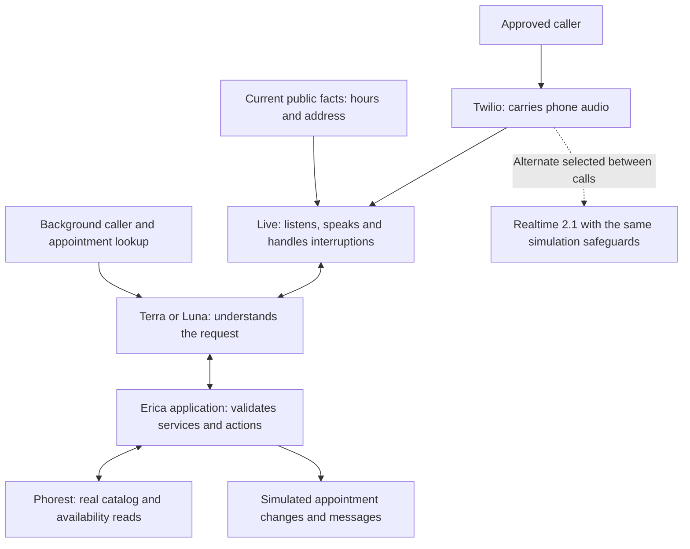

# Erica GPT-Live: owner taste-test release

September 12, 2026. **Deployed and ready for owner calls; human listening acceptance is pending.** Live + Terra is the default. Live + Luna and Realtime 2.1 can be selected between calls using the [owner guide](../GPT_LIVE_OWNER_TASTE_TEST_GUIDE_2026-09-12.md).

## What is available

Erica uses Live to listen, speak and handle interruptions. Terra or Luna interprets requests and selects application actions against the salon’s real catalog. The application still validates service IDs, availability and proposed appointment changes. Caller context warms during connection; public hours can be answered without waiting for the backend model.

Real Phorest lookups are enabled. Booking, cancellation, rescheduling, notes and messages are simulated; owner SMS, transfers, blocklist changes and digests are suppressed. Recording and ending an admitted phone call remain real. Customer intake remains disabled: only two approved owner/tester numbers can enter this test build.

This keeps the existing Twilio transport and application rather than introducing SIP or a separate planning service before the first taste test. Better interpretation does not remove the need for server validation, identity handling or approval checks.

## Exact deployment

| Item | Evidence |
| --- | --- |
| Runtime source | `254499c`, branch `codex/gpt-live-taste-test`, based on verified production `8533e61` |
| Workspace | `/Users/aryangupta/Documents/Dev/ai-receptionist-live-2026-09-12` |
| Railway release | `8d932448-3b96-4c7d-9bca-40ed46aa6519`, SUCCESS |
| Created | September 12, 2026, 18:27:09 UTC / 2:27 PM Eastern |
| Image | `sha256:db73f893e7919240eb211a04f4b854b3fa3b5d3b29c2ede2e116e397f6d623c9` |
| Host | `https://erica-production-f2e2.up.railway.app` |
| Final selection | Live + `gpt-5.6-terra`, default backend effort |
| Final status | Zero active calls, simulated writes/notifications, two approved callers |

Six running-container files matched local hashes: controller source/build, Live adapter source/build, Live prompts and simulated Phorest wrapper. Final health returned HTTP 200. Unauthenticated variant mutation returned 401. A correctly signed Twilio incoming webhook for an unapproved caller returned rejection and no audio stream.

The existing Twilio webhook and external forwarding were not changed. This is the existing Railway service restricted to approved testers, not a separate Railway service. Documentation-only commits following `254499c` do not change the deployed runtime.

Use the new build’s `realtime` variant for comparison or fallback: it retains the simulation safeguards. The previous Railway release predates these safeguards and should not be blindly restored as a taste-test fallback.

## Engineering verification

- **662 tests across 61 files passed**, TypeScript build passed, and `git diff --check` passed. Coverage includes proposal validation/retries, simulation boundaries, Live protocol/audio handling, closing races and test routing.
- Actual model/controller probes used real OpenAI calls and read-only Phorest, not just mocked model output.
- Hosted synthetic calls exercised Terra, Luna and Realtime. All three quoted the brow/upper-lip bundle at **$23**. Terra was restored afterward and the simulated overlay reset.
- The sampled hosted log contained three recording errors associated with synthetic call IDs. Those IDs are deliberately not actual Twilio calls; the probes cannot validate carrier recording. No other errors appeared in that sample.

| Scenario | Observed result | Evidence boundary |
| --- | --- | --- |
| Eyebrow + upper lip threading | Terra and Luna selected the real bundle and returned real future availability | Tool/catalog evidence verified; actual spoken times need listening |
| Bare “Is Richa available?” | Corrected prompt asks appointment vs. speaking with her; no service or transfer execution | Verified in final synthetic text/tool evidence |
| Today’s hours | Correct 10 AM–6 PM answer on test date, no backend response or tool call | Verified for this date/scenario |
| Seven-second availability read delay | Terra recovered and offered real results | Controlled local delay; not every provider outage |
| Ten normal greetings | 10/10 approximate transcripts include recording disclosure; first output speech 1.46–1.84 seconds, median 1.59 seconds | Synthetic timing, not handset latency or proof of audibility |
| Greeting interrupted by hours question | Request handled; disclosure appeared later in output | NEEDS LISTEN for interruption quality and disclosure audibility |
| Goodbye | Final probe ended after output drain with farewell evidence | Approximate text included “Goodb- Goodbye, and take care.” NEEDS LISTEN for fluency/clipping |

Observed premature contact collection was corrected to check service/availability before collecting contact details. Bare Richa availability no longer exposes the owner-transfer window as if it were personal appointment availability. The controller now requires farewell evidence and playback drain before a Live hangup, and aborts closing when new caller speech arrives.

Raw Live text fragments are approximate and timestamped; they are not final transcripts. Audio-dependent claims must be reviewed against recordings. The owner scorecard remains unscored until actual phone calls are heard.

## Initial cost observation

The three hosted synthetic comparisons used the same price question and ran about 29 seconds. Live reported 28 billable voice seconds. These are observed OpenAI estimates, excluding Twilio and synthetic caller speech generation.

| Version | Voice estimate | Backend estimate | Combined observed estimate |
| --- | ---: | ---: | ---: |
| Live + Luna | $0.02333 | $0.00176 | **$0.02509** |
| Live + Terra | $0.02333 | $0.01955 | **$0.04288** |
| Realtime 2.1 | Included in existing combined estimator | Included | **$0.04400** |

Terra used two backend responses and a price lookup; Luna used one backend response and the injected catalog. That difference contributes to cost. This one question is not a monthly forecast or evidence that one model wins the production workload. Compare matched booking, correction and interruption scenarios before choosing.

Configured rates were verified against the official model pages: [Live](https://developers.openai.com/api/docs/models/gpt-live-1), [Terra](https://developers.openai.com/api/docs/models/gpt-5.6-terra), and [Luna](https://developers.openai.com/api/docs/models/gpt-5.6-luna). Telemetry uses the latest cumulative Live duration and deduplicated backend response usage; missing usage remains unknown rather than zero.

## Remaining acceptance work

1. Owner calls on handset and speakerphone, comparing the same scenarios across all three versions. Pay particular attention to interruptions, recording disclosure, goodbye, and perceived delay.
2. Test identity changes and multiple appointments using the guide. Model-relayed approval is not independently proven caller consent; simulated success does not authorize real writes.
3. Decide on model preference and fixes after listening. Customer routing and real appointment changes require a separate acceptance decision.

No unsolicited phone call was placed to the owner. Private synthetic evidence is saved in `outputs/live-taste-test/probe-results.json` and `hosted-results.json` in the implementation workspace. Three output-only WAV samples are also there. These local artifacts are not deployed or included in the public documentation commit.
